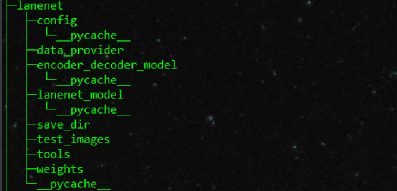
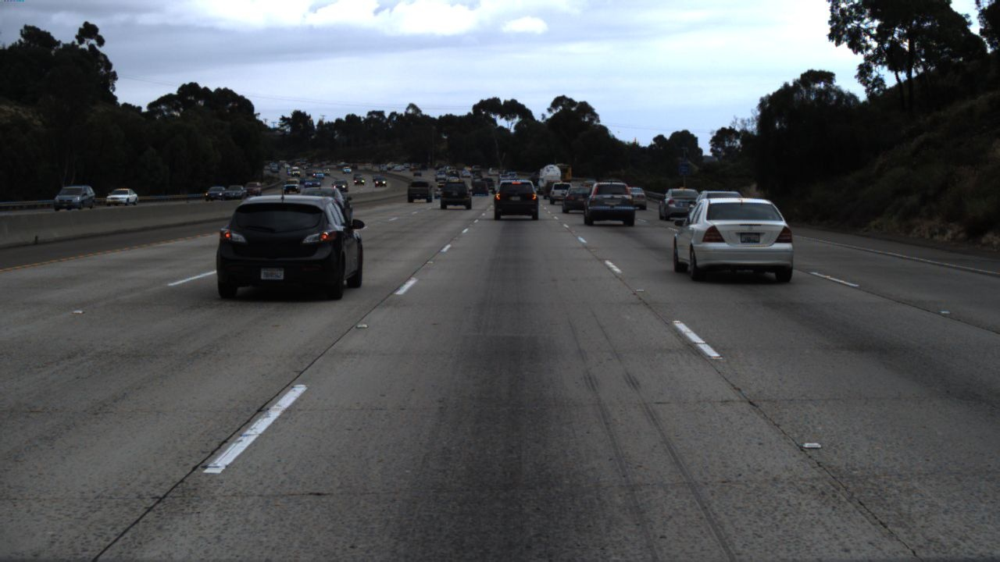
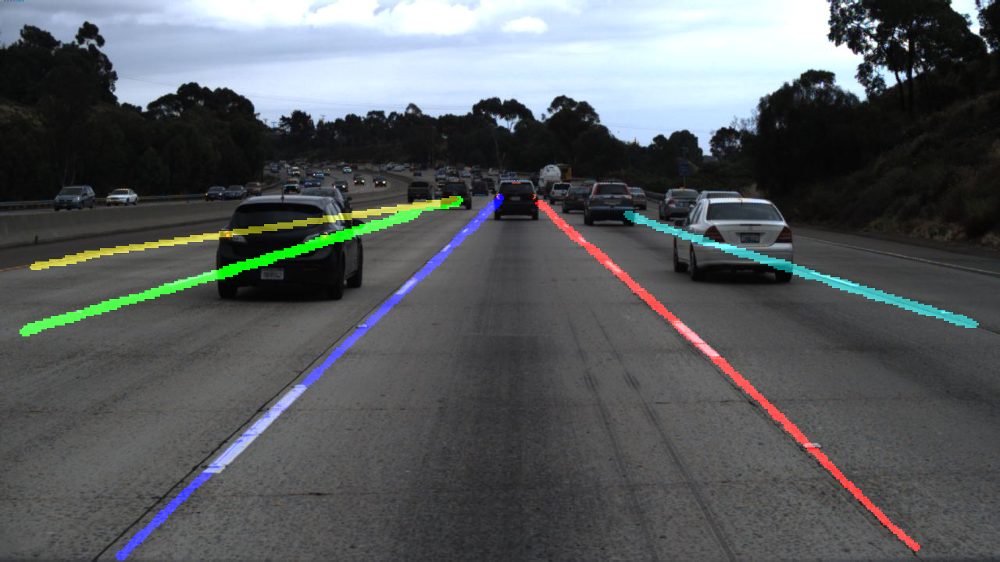

**[百度网盘下载权重文件后解压](https://pan.baidu.com/s/1gQd11N9fyl66QZ1EfzfC4g)  **  


## 车道线检测模块的使用

1. 解压后的文件结构

   

   

   2. 检测一张图片的脚本

      

      ```shell
      cd tools
      sh detection_image.sh
      ```

   3. 批量检测图片

      ```shell
      cd tools
      sh detection_images.sh
      ```

      检测结果保存在 save_dir文件夹中

   4. 检测效果展示

      

      

      